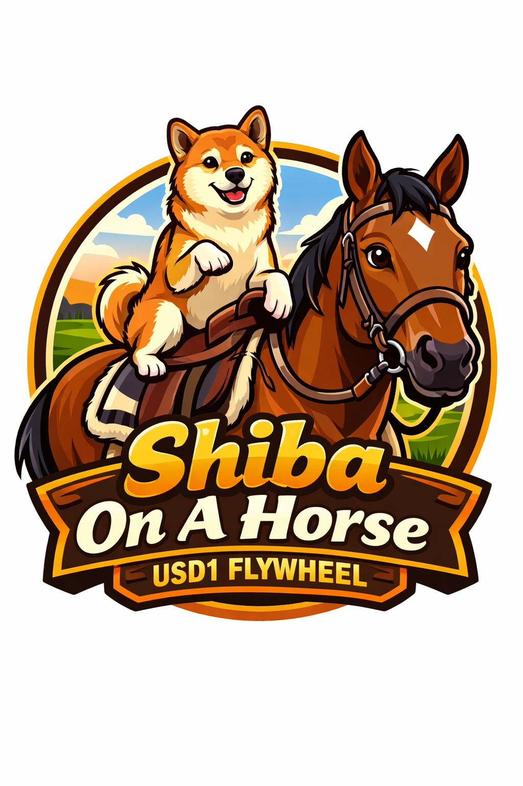

# 🐕🐎 Shiba On a Horse — USD1 Flywheel

**Shiba On a Horse USD1 Flywheel** is a meme-native, mechanism-driven value loop built on the USD1 narrative.

Inspired by the Chinese New Year pun:
> **馬上發財** — “Get rich immediately”  
> visually and phonetically mirrored as **Shiba on a Horse**

This project turns a viral cultural moment into an on-chain flywheel that converts attention → liquidity → buy pressure → redistribution.

No roadmap theater.  
No vague promises.  
Just a loop.

---

## 🧠 Concept Overview

Most memes stop at imagery.

Shiba On a Horse goes one step further:
- It **captures narrative energy**
- Routes it through **on-chain mechanics**
- And feeds it back to holders via a **USD1-aligned flywheel**

The result is a system where:
- Attention fuels volume
- Volume fuels the flywheel
- The flywheel feeds holders
- And the meme sustains itself

---

## ⚙️ The USD1 Flywheel

The flywheel is the core of the system.

### 1. Trade Activity
All buys and sells generate protocol fees.

### 2. Fee Routing
Fees are automatically split into:
- **USD1 reserve accumulation**
- **Flywheel execution capital**
- **Operational liquidity smoothing**

No manual intervention.  
No treasury discretion.

---

### 3. Flywheel Execution

At defined intervals, the system executes:
- USD1 → market buy pressure
- Market buys → price support
- Buybacks → redistribution logic

This creates **recursive demand** that scales with usage.

---

### 4. Redistribution

Recovered value is redistributed via:
- Holder-weighted mechanisms
- Time-weighted participation
- Anti-dump smoothing logic

Longer + larger participation = higher exposure to flywheel output.

---

## 🔄 Why USD1?

USD1 is not used as a gimmick.

It is used because:
- It provides **unit stability**
- Enables **predictable buy pressure**
- And decouples the flywheel from pure volatility

USD1 acts as:
- The flywheel’s **energy storage**
- A neutral execution medium
- A psychological anchor for value routing

---

## 🐕🐎 Why Shiba On a Horse?

Because memes don’t need explanation — but systems do.

This meme works because:
- It visually encodes “instant wealth”
- It bridges Eastern symbolism with crypto culture
- It is instantly legible, globally

The tech ensures it **doesn’t die after the joke peaks**.

---

## 🧩 Design Principles

- **Narrative First**  
  The meme attracts. The system retains.

- **Mechanics Over Promises**  
  Everything is automated or provable on-chain.

- **Flywheel > Roadmap**  
  If the loop works, nothing else matters.

- **Attention Is an Input**  
  Not just liquidity.

---

## 📊 System Flow (Simplified)

Attention → Volume
Volume → Fees
Fees → USD1
USD1 → Buybacks
Buybacks → Holders
Holders → Attention

A closed loop.  
No leaks.

---

## 🔍 Transparency

- All flows are on-chain
- All routing is deterministic
- No hidden wallets
- No discretionary minting
- No governance theater

If the flywheel stops, the system stops.

---

## 🚫 What This Is Not

- Not a stablecoin
- Not an AI token
- Not a charity
- Not a VC vehicle
- Not a promise of profit

It is a **mechanism attached to a meme**.

---

## 🏁 Final Note

Most memes ask:
> “How high can this go?”

Shiba On a Horse asks:
> “How long can this loop sustain itself?”

If attention persists, the flywheel spins.

---

**馬上發財**  
**Shiba On a Horse**  
**USD1 Flywheel**

